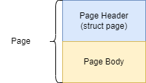

# Page
Page由Header和Body两部分构成，Page相关的代码位于`page.go`中。根据用途来分，页分为以下四类：
- meta page(元数据页)：记录数据库的元数据。
- freelist page(空闲页列表)：记录空闲页。
- branch page(分支页)：记录索引key。
- leaf page(叶子页)：记录k/v键值对。



## Page Header
*Page Header*以**page**结构体表示，记录页的元数据
```go
type pgid uint64

type page struct {
    id       pgid
    flags    uint16
    count    uint16
    overflow uint32
    ptr      uintptr
}
```
| 字段 | 描述         |
|---|------------|
| id | 页id        |
|flags| 页类型        |
|count| 页元素数量      |
|overflow| 页溢出数       |
|ptr| Page Body的起始位置 |

## Page Body
不同类型页的Body各不相同。

### meta page body
meta page的body就是一个`meta`结构体，位于`db.go`文件中。
```go
type meta struct {
	magic    uint32
	version  uint32
	pageSize uint32
	flags    uint32
	root     bucket
	freelist pgid
	pgid     pgid
	txid     txid
	checksum uint64
}

// bucket.go
type bucket struct {
	root     pgid   // page id of the bucket's root-level page
	sequence uint64 // monotonically incrementing, used by NextSequence()
}
```

| 字段 | 描述 |
| --- | --- |
|magic|固定值，用来标识该文件是boltdb的数据库文件|
|version|标识该文件采用的数据库版本号|
|pageSize|表示该文件采用的页大小|
|flags|保留字段，未使用|
|root||
|freelist|空闲页列表的首页id|
|pgid|下一次分配的页id，用于mmap扩容时的新页编号|
|txid|下一次分配的事务id，全局单调递增|
|checksum|meta page的校验和|

### freelist page body
freelist page的body是一个`freelist`结构体，位于`freelist.go`中。
```go
type freelist struct {
	ids     []pgid          // all free and available free page ids.
	pending map[txid][]pgid // mapping of soon-to-be free page ids by tx.
	cache   map[pgid]bool   // fast lookup of all free and pending page ids.
}
```
| 字段 | 描述 |
| --- | --- |
| ids |记录已释放的页id|
|pending|记录事务下待释放的页id|
|cache|缓存页是否被释放，出现在ids和pending中的页id均为true|