# Page
Page由Header和Body两部分构成，相关代码位于`page.go`中。根据用途来分，页分为以下四类：
- meta page(元数据页)：记录数据库的元数据。
- freelist page(空闲列表页)：记录空闲页。
- branch page(分支页)：记录索引key。
- leaf page(叶子页)：记录k/v键值对。

**每种页都包含两种存储结构，内存存储结构和文件(磁盘)存储结构。**


## Page Header
*Page Header*以**page**结构体表示，记录页的元数据，所有页类型共用该结构。
```go
type pgid uint64

type page struct {
    id       pgid
    flags    uint16
    count    uint16
    overflow uint32
    ptr      uintptr
}
```
|   字段   | 描述         |
|:------:|------------|
|id pgid | 页id        |
|flags uint16 | 页类型        |
|count uint16 | 页元素数量      |
|overflow uint32 | 页溢出数       |
|ptr uintptr | Page Body的起始位置 |

## meta page
meta page的body是一个`meta`结构体，位于`db.go`文件中。
```go
type meta struct {
	magic    uint32
	version  uint32
	pageSize uint32
	flags    uint32
	root     bucket
	freelist pgid
	pgid     pgid
	txid     txid
	checksum uint64
}

// bucket.go
type bucket struct {
	root     pgid   // page id of the bucket's root-level page
	sequence uint64 // monotonically incrementing, used by NextSequence()
}
```

|        字段        | 描述 |
|:----------------:| --- |
|   magic uint32   |固定值，用来标识该文件是boltdb的数据库文件|
|  version uint32  |标识该文件采用的数据库版本号|
| pageSize uint32  |表示该文件采用的页大小|
|   flags uint32   |保留字段，未使用|
|   root bucket    ||
|  freelist pgid   |空闲页列表的首页id|
|    pgid pgid     |下一次分配的页id，用于mmap扩容时的新页编号|
|    txid txid     |下一次分配的事务id，全局单调递增|
| checksum uint64  |meta page的校验和|

## freelist page
### 内存存储结构
```go
type freelist struct {
	ids     []pgid          // all free and available free page ids.
	pending map[txid][]pgid // mapping of soon-to-be free page ids by tx.
	cache   map[pgid]bool   // fast lookup of all free and pending page ids.
}
```
|            字段            | 描述                                 |
|:------------------------:|------------------------------------|
|        ids []pgid        | 记录已释放的页id                          |
| pending map[txid][]pgid  | 记录事务下待释放的页id                       |
|   cache map[pgid]bool    | 标记页是否被释放，出现在ids和pending中的页id均为true |

由于boltdb是通过copy-on-write的方式实现读写事务并发的隔离，因此当事务写事务更新页时，事务会先拷贝出一份新页，并将旧页加入`pending`待释放页列表中。
因为此时可能还有读事务在读取旧页，所以不能立即释放该页，而是要等到所有事务都不使用该页时，才能将其从`pending`移入`ids`中。

另一个好处是，当写事务进行回滚时，可以重用`pending`中待释放的页，只需将`pending`中该事务id对应的列表清空即可。
### 文件存储结构
当boltdb将freelist写入page(文件)时，会将`pending`中的页id合并至`ids`中，然后再写入。

由于`page header`的`count`字段为`unit16`类型，最大值为`0xFFFF`(65536)，所以当freelist page的元素(pgid)超过该值时，需要特殊处理，
如下图所示：将本应写入第一条pgid的位置用来记录真实的元素值，同时将`count`置为`0xFF`。



### 相互转换操作
```go
// read initializes the freelist from a freelist page.
func (f *freelist) read(p *page) {
	// If the page.count is at the max uint16 value (64k) then it's considered
	// an overflow and the size of the freelist is stored as the first element.
	idx, count := 0, int(p.count)
	if count == 0xFFFF {
		idx = 1
		count = int(((*[maxAllocSize]pgid)(unsafe.Pointer(&p.ptr)))[0])
	}

	// Copy the list of page ids from the freelist.
	if count == 0 {
		f.ids = nil
	} else {
		ids := ((*[maxAllocSize]pgid)(unsafe.Pointer(&p.ptr)))[idx:count]
		f.ids = make([]pgid, len(ids))
		copy(f.ids, ids)

		// Make sure they're sorted.
		sort.Sort(pgids(f.ids))
	}

	// Rebuild the page cache.
	f.reindex()
}

// write writes the page ids onto a freelist page. All free and pending ids are
// saved to disk since in the event of a program crash, all pending ids will
// become free.
func (f *freelist) write(p *page) error {
	// Combine the old free pgids and pgids waiting on an open transaction.

	// Update the header flag.
	p.flags |= freelistPageFlag

	// The page.count can only hold up to 64k elements so if we overflow that
	// number then we handle it by putting the size in the first element.
	lenids := f.count()
	if lenids == 0 {
		p.count = uint16(lenids)
	} else if lenids < 0xFFFF {
		p.count = uint16(lenids)
		f.copyall(((*[maxAllocSize]pgid)(unsafe.Pointer(&p.ptr)))[:])
	} else {
		p.count = 0xFFFF
		((*[maxAllocSize]pgid)(unsafe.Pointer(&p.ptr)))[0] = pgid(lenids)
		f.copyall(((*[maxAllocSize]pgid)(unsafe.Pointer(&p.ptr)))[1:])
	}

	return nil
}

```
## branch/leaf page
### 内存存储结构
branch/leaf page的内存结构定义在`node.go`中。
```go
type node struct {
	bucket     *Bucket
	isLeaf     bool
	unbalanced bool
	spilled    bool
	key        []byte
	pgid       pgid
	parent     *node
	children   nodes
	inodes     inodes
}
```
|        字段        | 描述                                                 |
|:----------------:|----------------------------------------------------|
|  bucket *Bucket  | 该node所属的bucket                                     |
|   isLeaf bool    | 该node是否为叶子节点                                       |
| unbalanced bool  | 该node是否不平衡                                         |
|   spilled bool   | 该node是否被调整过                                        |
|    key []byte    | 保存node初始化时的第一个key                                  |
|    pgid pgid     | 该node在mmap内存(文件)中相应的页id                            |
|   parent *node   | 该node的父节点                                          |
|  children nodes  | 保存已实例化(堆内存化)的孩子节点，用于spill时递归向下更新node               |
|  inodes inodes   | 该node的内部节点(branchPage/leafPage的构成元素) |
```go
// branchPageElement represents a node on a branch page.
type branchPageElement struct {
	pos   uint32
	ksize uint32
	pgid  pgid
}
```
```go
// leafPageElement represents a node on a leaf page.
type leafPageElement struct {
    flags uint32    
    pos   uint32
    ksize uint32
    vsize uint32
}
```

### 文件存储结构



### 相互转换操作
```go
// read initializes the node from a page.
func (n *node) read(p *page) {
	n.pgid = p.id
	n.isLeaf = ((p.flags & leafPageFlag) != 0)
	n.inodes = make(inodes, int(p.count))

	for i := 0; i < int(p.count); i++ {
		inode := &n.inodes[i]
		if n.isLeaf {
			elem := p.leafPageElement(uint16(i))
			inode.flags = elem.flags
			inode.key = elem.key()
			inode.value = elem.value()
		} else {
			elem := p.branchPageElement(uint16(i))
			inode.pgid = elem.pgid
			inode.key = elem.key()
		}
		_assert(len(inode.key) > 0, "read: zero-length inode key")
	}

	// Save first key so we can find the node in the parent when we spill.
	if len(n.inodes) > 0 {
		n.key = n.inodes[0].key
		_assert(len(n.key) > 0, "read: zero-length node key")
	} else {
		n.key = nil
	}
}

// write writes the items onto one or more pages.
func (n *node) write(p *page) {
	// Initialize page.
	if n.isLeaf {
		p.flags |= leafPageFlag
	} else {
		p.flags |= branchPageFlag
	}

	if len(n.inodes) >= 0xFFFF {
		panic(fmt.Sprintf("inode overflow: %d (pgid=%d)", len(n.inodes), p.id))
	}
	p.count = uint16(len(n.inodes))

	// Stop here if there are no items to write.
	if p.count == 0 {
		return
	}

	// Loop over each item and write it to the page.
	b := (*[maxAllocSize]byte)(unsafe.Pointer(&p.ptr))[n.pageElementSize()*len(n.inodes):]
	for i, item := range n.inodes {
		_assert(len(item.key) > 0, "write: zero-length inode key")

		// Write the page element.
		if n.isLeaf {
			elem := p.leafPageElement(uint16(i))
			elem.pos = uint32(uintptr(unsafe.Pointer(&b[0])) - uintptr(unsafe.Pointer(elem)))
			elem.flags = item.flags
			elem.ksize = uint32(len(item.key))
			elem.vsize = uint32(len(item.value))
		} else {
			elem := p.branchPageElement(uint16(i))
			elem.pos = uint32(uintptr(unsafe.Pointer(&b[0])) - uintptr(unsafe.Pointer(elem)))
			elem.ksize = uint32(len(item.key))
			elem.pgid = item.pgid
			_assert(elem.pgid != p.id, "write: circular dependency occurred")
		}

		// If the length of key+value is larger than the max allocation size
		// then we need to reallocate the byte array pointer.
		//
		// See: https://github.com/boltdb/bolt/pull/335
		klen, vlen := len(item.key), len(item.value)
		if len(b) < klen+vlen {
			b = (*[maxAllocSize]byte)(unsafe.Pointer(&b[0]))[:]
		}

		// Write data for the element to the end of the page.
		copy(b[0:], item.key)
		b = b[klen:]
		copy(b[0:], item.value)
		b = b[vlen:]
	}

	// DEBUG ONLY: n.dump()
}

```