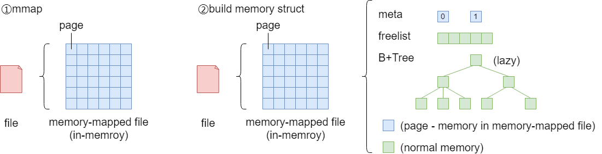
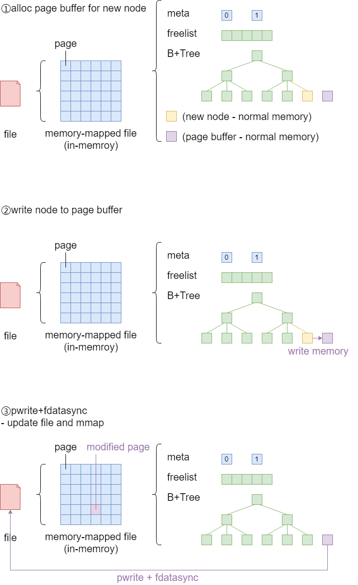

# boltdb的读写缓存策略
boltdb的缓存策略主要有两种，一种是使用mmap的读缓存策略，另一种是使用page buffer的写缓存策略。

## 读操作与缓存策略
boltdb在打开数据库时，通过系统调用mmap将数据映射到进程虚拟内存空间。这样就可以直接以内存的方式读取数据，减少磁盘IO。

经过mmap映射后的数据，在使用上主要有两种方式：
1. boltdb将meta直接指向了mmap内存空间的meta page，但仅能读，不能写。当创建新事务时，boltdb会复制当前meta page到进程内存中，作为该事务开始时的meta快照。
2. freelist和B+Tree都是根据mmap内存空间的page在进程内存中构建数据结构。freelist是在打开数据库时完整地读取mmap内存空间中的freelist page构建；B+Tree则
是在使用中按需构建，即在读取B+Tree的node时，如果node已经在缓存中构建过，则读取已经构建好的缓存，如果node还没在缓存中构建过，则读取mmap内存空间中的数据，在
内存别处构建node的缓存。



### mmap
```c
void *mmap(void *start,size_t length,int prot,int flags,int fd,off_t offsize);
```
mmap的实质就是从每一个进程中的用户空间分配一段空间用于映射。
- start:指向欲映射的内存起始地址，通常设为NULL，代表让系统自动选定地址，映射成功后返回该地址。
- length:代表将文件中多大的部分映射到内存。
- prot:映射区域的保护方式。可以为以下几种方式的组合：
  - PROT_EXEC:映射区域可被执行 
  - PROT_READ:映射区域可被读取 
  - PROT_WRITE:映射区域可被写入 
  - PROT_NONE:映射区域不能存取
- flags:在调用mmap()时必须要指定MAP_SHARED 或MAP_PRIVATE。
  - MAP_FIXED:
  - MAP_SHARED:对应射区域的写入数据会复制回文件内，而且允许其它映射该文件的进程共享数据。
  - MAP_PRIVATE:对应射区域的写入操作会产生一个映射文件的复制，即私人的"写入时复制"(copy on write)对此区域作的任何修改都不会写回原来的文件内容。
  - MAP_ANONYMOUS:建立匿名映射，此时会忽略参数fd，不涉及文件，而且映射区域无法和其他进程共享。
  - MAP_DENYWRITE:只允许对映射区域的写入操作，其它对文件直接写入的操作将会被拒绝。
  - MAP_LOCKED:将映射区域锁定住，表示该区域不会被置换（swap）。
- fd:要映射到内存中的文件描述符。
- offset:文件映射的偏移量，通常设置为0，代表从文件最前方开始对应，offset必须是PAGE_SIZE的整数倍。

| 方法                               | 描述  |
|----------------------------------|-----|
| mmap(minsz int) error            | 以内存映射文件的方式打开数据库文件并初始化meta引用。参数minsz是最小的mmap大小，其实际mmap大小是通过mmapSize方法获取的|
| munmap() error                   | 取消文件的内存映射|
| mmapSize(size int) (int, error)  | 计算mmap大小，参数size是最小大小|

```go
// db.go 243

// mmap opens the underlying memory-mapped file and initializes the meta references.
// minsz is the minimum size that the new mmap can be.
func (db *DB) mmap(minsz int) error {
	db.mmaplock.Lock()
	defer db.mmaplock.Unlock()

	info, err := db.file.Stat()
	if err != nil {
		return fmt.Errorf("mmap stat error: %s", err)
	} else if int(info.Size()) < db.pageSize*2 {
		return fmt.Errorf("file size too small")
	}

	// Ensure the size is at least the minimum size.
	var size = int(info.Size())
	if size < minsz {
		size = minsz
	}
	size, err = db.mmapSize(size)
	if err != nil {
		return err
	}

	// Dereference all mmap references before unmapping.
	if db.rwtx != nil {
		db.rwtx.root.dereference()
	}

	// Unmap existing data before continuing.
	if err := db.munmap(); err != nil {
		return err
	}

	// Memory-map the data file as a byte slice.
	// 调用Linux的system call
	if err := mmap(db, size); err != nil {
		return err
	}

	// Save references to the meta pages.
	db.meta0 = db.page(0).meta()
	db.meta1 = db.page(1).meta()

	// Validate the meta pages. We only return an error if both meta pages fail
	// validation, since meta0 failing validation means that it wasn't saved
	// properly -- but we can recover using meta1. And vice-versa.
	err0 := db.meta0.validate()
	err1 := db.meta1.validate()
	if err0 != nil && err1 != nil {
		return err0
	}

	return nil
}

// munmap unmaps the data file from memory.
func (db *DB) munmap() error {
	if err := munmap(db); err != nil {
		return fmt.Errorf("unmap error: " + err.Error())
	}
	return nil
}

// mmapSize determines the appropriate size for the mmap given the current size
// of the database. The minimum size is 32KB and doubles until it reaches 1GB.
// Returns an error if the new mmap size is greater than the max allowed.
// mmap大小最小为32KB，在1GB之前mmap大小每次倍增，在1GB之后每次增长1GB。
func (db *DB) mmapSize(size int) (int, error) {
	// Double the size from 32KB until 1GB.
	for i := uint(15); i <= 30; i++ {
		if size <= 1<<i {
			return 1 << i, nil
		}
	}

	// Verify the requested size is not above the maximum allowed.
	if size > maxMapSize {
		return 0, fmt.Errorf("mmap too large")
	}

	// If larger than 1GB then grow by 1GB at a time.
	sz := int64(size)
	if remainder := sz % int64(maxMmapStep); remainder > 0 {
		sz += int64(maxMmapStep) - remainder
	}

	// Ensure that the mmap size is a multiple of the page size.
	// This should always be true since we're incrementing in MBs.
	pageSize := int64(db.pageSize)
	if (sz % pageSize) != 0 {
		sz = ((sz / pageSize) + 1) * pageSize
	}

	// If we've exceeded the max size then only grow up to the max size.
	if sz > maxMapSize {
		sz = maxMapSize
	}

	return int(sz), nil
}
```

```go
// bolt_unix.go

// flock acquires an advisory lock on a file descriptor.
func flock(db *DB, mode os.FileMode, exclusive bool, timeout time.Duration) error {
	var t time.Time
	for {
		// If we're beyond our timeout then return an error.
		// This can only occur after we've attempted a flock once.
		if t.IsZero() {
			t = time.Now()
		} else if timeout > 0 && time.Since(t) > timeout {
			return ErrTimeout
		}
		flag := syscall.LOCK_SH
		if exclusive {
			flag = syscall.LOCK_EX
		}

		// Otherwise attempt to obtain an exclusive lock.
		err := syscall.Flock(int(db.file.Fd()), flag|syscall.LOCK_NB)
		if err == nil {
			return nil
		} else if err != syscall.EWOULDBLOCK {
			return err
		}

		// Wait for a bit and try again.
		time.Sleep(50 * time.Millisecond)
	}
}

// funlock releases an advisory lock on a file descriptor.
func funlock(db *DB) error {
	return syscall.Flock(int(db.file.Fd()), syscall.LOCK_UN)
}

// mmap memory maps a DB's data file.
func mmap(db *DB, sz int) error {
	// Map the data file to memory.
	b, err := syscall.Mmap(int(db.file.Fd()), 0, sz, syscall.PROT_READ, syscall.MAP_SHARED|db.MmapFlags)
	if err != nil {
		return err
	}

	// Advise the kernel that the mmap is accessed randomly.
	if err := madvise(b, syscall.MADV_RANDOM); err != nil {
		return fmt.Errorf("madvise: %s", err)
	}

	// Save the original byte slice and convert to a byte array pointer.
	db.dataref = b
	db.data = (*[maxMapSize]byte)(unsafe.Pointer(&b[0]))
	db.datasz = sz
	return nil
}

// munmap unmaps a DB's data file from memory.
func munmap(db *DB) error {
	// Ignore the unmap if we have no mapped data.
	if db.dataref == nil {
		return nil
	}

	// Unmap using the original byte slice.
	err := syscall.Munmap(db.dataref)
	db.dataref = nil
	db.data = nil
	db.datasz = 0
	return err
}
```

boltdb在进行映射时，mmap大小可能超过数据库文件大小。***在访问超出文件大小的mmap部分时会引起SIGBUS异常***。
为了避免访问到超出文件的部分，同时尽可能减少对底层文件大小的的不必要的增长，boltdb选择的是在事务提交时按需增长底层文件大小的策略。

## 写操作与缓存策略
数据库系统需要保证事务提交时，数据需要安全的写入磁盘或其它IO设备。由于频繁的IO会导致系统性能下降，所以boltdb采取了缓存策略。先将修改后
的数据写到一块page buffer内存中，等事务提交时，再将page buffer中的数据顺序的写入IO设备。为保证数据落盘，boltdb采用了pwrite+fdatasyc实现。



### page buffer(memory——>memory)
无论是修改meta、freelist，还是修改或写入新B+Tree的node时，boltdb都会先将数据按照page结构写入mmap内存空间外的page buffer中，
等到事务提交时再将page buffer中数据写入到底层数据库文件相应的page处。分配page buffer的逻辑在db.go的allocate方法中：
```go
// allocate returns a contiguous block of memory starting at a given page.
func (db *DB) allocate(count int) (*page, error) {
	// Allocate a temporary buffer for the page.
	var buf []byte
	if count == 1 {
		buf = db.pagePool.Get().([]byte)
	} else {
		buf = make([]byte, count*db.pageSize)
	}
	p := (*page)(unsafe.Pointer(&buf[0]))
	p.overflow = uint32(count - 1)

	// Use pages from the freelist if they are available.
	if p.id = db.freelist.allocate(count); p.id != 0 {
		return p, nil
	}

	// Resize mmap() if we're at the end.
	p.id = db.rwtx.meta.pgid
	var minsz = int((p.id+pgid(count))+1) * db.pageSize
	if minsz >= db.datasz {
		if err := db.mmap(minsz); err != nil {
			return nil, fmt.Errorf("mmap allocate error: %s", err)
		}
	}

	// Move the page id high water mark.
	db.rwtx.meta.pgid += pgid(count)

	return p, nil
}
```
allocate方法会创建一段能够容纳给定数量page的连续内存空间，这段空间就是page buffer，然后将这段空间作为page返回给调用者。这样，调用者可以向读写正常page一样读写这段page buffer。
在分配page buffer时，需要分配的page buffer长度为1，boltdb会通过pagePool分配；在事务提交时，boltdb将page buffer中的数据写入到文件后，会将长度为1的page buffer放回pagePool。
而如果所需的page buffer长度大于1，则boltdb会通过make分配page buffer的内存空间。

### pwrite+fdatasync(memory——>disk)
Linux系统将数据写入文件时，通常会先将用户缓冲区的数据拷贝到内核中的某个缓冲区，如果该缓冲区未写满，则并不将其排队到*写队列*，而是等待其写满或内核空闲的缓冲区不足但需要
重用该缓冲区存放其它数据时，再将其排队到写队列，只有当其到达队头时，才会进行实际的落盘操作，这种方式被称为延迟写(delayed write)。

当调用write()函数写数据时，一旦数据写到内核某个缓冲区，函数便马上返回。此时写完的数据能够用read()读回，也能够被其它进程读到，
但这并不意味着数据已被写到了永久存储介质上。即使调用close()关闭文件后也可能如此，因为缓冲区的数据可能还在等待输出。

- write/pwrite:将用户缓冲区数据写至内核缓冲区。
  - write:
  ```c
  ssize_t write (int filedes, const void *buf, size_t nbytes );
  ```
  - pwrite:由于lseek和write 调用之间，内核可能会临时挂起进程，所以对同步问题造成了问题，调用pwrite相当于顺序调用了lseek和write，这两个操作相当于一个捆绑的原子操作。
  ```c
  ssize_t pwrite (int filedes, const void *buf, size_t nbytes, off_t offset );
  ```

- sync/fsync/fdatasync/msync:将内核缓冲区的数据写进磁盘
  - sync:只是将所有修改过的缓冲区加入写队列，然后就返回，它并不等待实际写磁盘操作结束，所以也有可能出现掉电数据丢失。通常有一个update的系统守护进程会周期性地（一般每隔30秒）调用sync函数。这就保证了定期清洗内核的缓冲区。
  - fsync:只能用于指定的单个文件，fsync不仅会同步更新文件数据，还会同步更新文件的元数据(比如atime,mtime等)。
  - fdatasync:仅更新文件数据和并要的元数据(如文件大小)
  - msync:需要指定同步的地址区间，如此细粒度的控制似乎比fsync更加高效(因为应用程序通常知道自己的脏页位置)，**但实际上内核中有着十分高效的数据结构，能够很快地找出文件的脏页，使得fsync只会同步被修改的内容**。

**fsync和fdatasync的差异**：
 - fsync:总会初始化两个写操作，一个用于更新数据，另一个用于更新存储在inode中的mtime(更新时间)。如果mtime不属于事务概念的一部分，可以使用fdatsync来避免不必要的inode磁盘写操作。从而减少一次IO。
 - fdatasync:与fsync类似，仅在必要的情况下才会同步metadata，**因此大多数情况下可以减少一次IO写操作**。比如：文件的尺寸（st_size）如果变化，是需要立即同步的，否则OS一旦崩溃，即使文件的数据部分已同步，
由于metadata没有同步，依然读不到修改的内容。而最后访问时间(atime)/修改时间(mtime)是不需要每次都同步的，只要应用程序对这两个时间戳没有苛刻的要求，基本无伤大雅。

**使用fdatasync优化日志同步**：
数据库的日志文件是常常需要同步IO的，在同步上fsync是低效的。如果使用fdatasync减少对metadata的更新，则需要确保文件的大小在write前后没有发生变化。日志文件天生是追加型（append-only）的，总是在不断增大，似乎很难利用好fdatasync。
Berkeley DB的处理方式：
1. 每个log文件固定为10MB大小，从1开始编号，名称格式为“log.%010d”
2. 每次log文件创建时，先写文件的最后1个page，将log文件扩展为10MB大小
3. 向log文件中追加记录时，由于文件的尺寸不发生变化，使用fdatasync可以大大优化写log的效率
4. 如果一个log文件写满了，则新建一个log文件，也只有一次同步metadata的开销

虽然boltdb使用了mmap，但是当事务提交时，其还是通过pwrite+fdatasync的方式同步刷盘。通过mmap的flags描述可知，使用SHARED的mmap，当其它进程通过`fdatasync`等系统调用修改底层文件后，操作系统会保证mmap映射的内存空间能够及时更新。
```go
// write writes any dirty pages to disk.
func (tx *Tx) write() error {
	// Sort pages by id.
	pages := make(pages, 0, len(tx.pages))
	for _, p := range tx.pages {
		pages = append(pages, p)
	}
	// Clear out page cache early.
	tx.pages = make(map[pgid]*page)
	sort.Sort(pages)

	// Write pages to disk in order.
	for _, p := range pages {
		size := (int(p.overflow) + 1) * tx.db.pageSize
		offset := int64(p.id) * int64(tx.db.pageSize)

		// Write out page in "max allocation" sized chunks.
		ptr := (*[maxAllocSize]byte)(unsafe.Pointer(p))
		for {
			// Limit our write to our max allocation size.
			sz := size
			if sz > maxAllocSize-1 {
				sz = maxAllocSize - 1
			}

			// Write chunk to disk.
			buf := ptr[:sz]
			if _, err := tx.db.ops.writeAt(buf, offset); err != nil {
				return err
			}

			// Update statistics.
			tx.stats.Write++

			// Exit inner for loop if we've written all the chunks.
			size -= sz
			if size == 0 {
				break
			}

			// Otherwise move offset forward and move pointer to next chunk.
			offset += int64(sz)
			ptr = (*[maxAllocSize]byte)(unsafe.Pointer(&ptr[sz]))
		}
	}

	// Ignore file sync if flag is set on DB.
	if !tx.db.NoSync || IgnoreNoSync {
		if err := fdatasync(tx.db); err != nil {
			return err
		}
	}

	// Put small pages back to page pool.
	for _, p := range pages {
		// Ignore page sizes over 1 page.
		// These are allocated using make() instead of the page pool.
		if int(p.overflow) != 0 {
			continue
		}

		buf := (*[maxAllocSize]byte)(unsafe.Pointer(p))[:tx.db.pageSize]

		// See https://go.googlesource.com/go/+/f03c9202c43e0abb130669852082117ca50aa9b1
		for i := range buf {
			buf[i] = 0
		}
		tx.db.pagePool.Put(buf)
	}

	return nil
}
```
在事务提交时，boltdb会先将事务使用的page buffer按照页id排序，然后将page buffer中的内容通过WriteAt方法(底层是`pwrite`系统调用)写入(mmap内存？内核缓冲区？)。
然后通过`fdatasync`系统调用等待数据安全地同步到磁盘中。最后，boltdb将待释放的长度为1的page buffer放回到pagePool中，以复用这些单页，减少内存碎片的影响。
