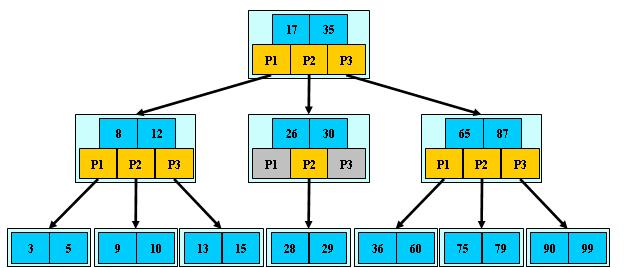
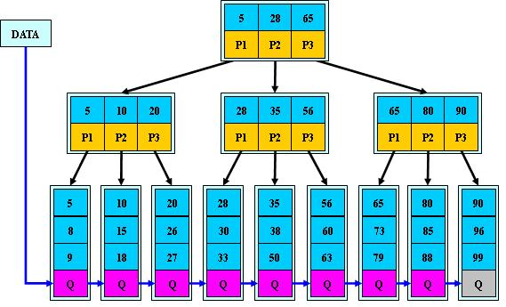
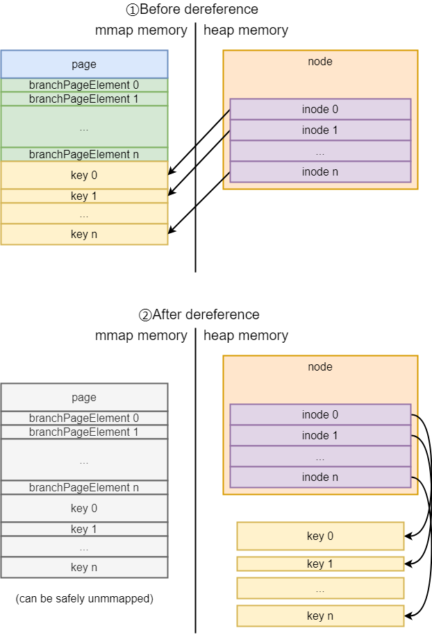

# B、B+Tree
m阶B-Tree定义：
1. 每个节点至多有M个子节点
2. 如果根节点不是叶子节点，根节点至少有两个子节点 
3. 每个中间节点至少有m/2个子节点 (m/2向上取整)
4. 有K个子节点的非叶子节点中包含K-1个Key
5. 所有叶子节点都在同一层



m阶B+Tree定义：
1. 每个节点至多有M个子节点
2. 如果根节点不是叶子节点，根节点至少有两个子节点
3. 每个中间节点至少有m/2个子节点 (m/2向上取整)
4. 非叶子节点的子树指针与**Key(索引值)个数**相同，子树指针P[i]指向Key属于[K[i],K[i+1])的子树(*root节点的P1指针指向[5,28)的子树*)
6. 数据(索引!=数据)仅保留在叶子节点上，且叶子节点存在一个链指针，按从小到大的顺序指向下一个叶子节点，所有Key都出现在叶子节点。

优点：
- 中间节点不保留数据，这样一个中间节点可以保留更多的索引，在相同数据量下，可以使树高更低，减少IO次数。
- 数据都保留在叶子节点上，即所有查询都落在叶子节点上，IO次数相同，查询更加稳定。
- 叶子节点形成有序链表，范围查询更加高效。



# boltdb中索引的实现
B-Tree和B+Tree都是为了减少磁盘IO而设计的高级数据结构。B+Tree的工程实现往往与存储系统的使用场景、硬件环境密相关,涉及到很多与I/O、缓存相关问题。因此**B+Tree并没有一种“标准”的实现**，。
boltdb按照实际的场景对B+Tree进行了一定的修改来实现其索引结构：
1. 使用数据填充率来限制节点大小。`数据填充率=节点数据大小/pageSize`。除根节点外的每个非叶子节点的数据填充率不小于`fillPercent`。理论上，节点的数据填充率不能大于1，但实际上，由于一些key/value数据过大，节点填充率可能超过1，这样的节点也是合法的节点。
2. 数据直接保存在叶子节点中，而不是通过指针指向其它页。
3. 叶子节点没有实现链指针。因此在进行范围查询时需要借助其它方式。
4. B+Tree只有在需要写入到文件时才会进行调整以保持平衡。在内存中，B+Tree可能并不平衡。

树(Tree)的构成元素是节点(Node)，要描述一颗树，理论上只需要知道根节点即可。所以在构造树时，关注的重点应该是在节点的实现上。boltdb的B+Tree节点在存储结构上分为磁盘存储和内存存储。

B+Tree节点的磁盘存储结构(mmap memory)实现是branchNodePage与leafNodePage。内存存储结构由node实现。node是按需实例化的，对于不需要修改的node，boltdb直接从page中读取数据；而当boltdb需要修改B+Tree的某个节点时，则会将该节点从page实例化为node。
在修改node时，boltdb会为其分配page buffer，等到事务提交时，才会将这些page buffer中的数据统一落盘。

## node结构体
node结构体表示了boltdb中B+Tree节点的内存实现。**即一个node实例等于一个page**。
```go
// node represents an in-memory, deserialized page.
type node struct {
	bucket     *Bucket
	isLeaf     bool
	unbalanced bool
	spilled    bool
	key        []byte
	pgid       pgid
	parent     *node
	children   nodes
	inodes     inodes
}

// inode represents an internal node inside of a node.
// It can be used to point to elements in a page or point
// to an element which hasn't been added to a page yet.
type inode struct {
	flags uint32
	pgid  pgid
	key   []byte
	value []byte
}

type inodes []inode
```

| 字段              | 描述                                                 |
|-----------------|----------------------------------------------------|
| bucket *Bucket  | 该node所属的bucket                                     |
| isLeaf bool | 该node是否为叶子节点                                       |
| unbalanced bool | 该node是否不平衡                                         |
| spilled bool | 该node是否调整过                                         |
| key []byte | 保存node初始化时的第一个key，用于在调整时索引                         |
| pgid pgid | 该node在mmap内存中对应的页id                                |
| parent *node | 父节点                                                |
| children nodes | 保存已实例化的子节点的node                                    |
| inodes inodes | 该node的内部节点(branchPage/leafPage的构成元素) |

从page构建node实例时，`inode`的key和value都是直接引用page(mmap内存空间)的地址，所以node实例是依赖于page中的数据的。随着数据量的增大，boltdb需要重新分配mmap空间，此时node需要执行`deference`。
递归向下地将B+Tree中的已实例化的node中的数据拷贝到`heap memory`，避免unmmap时node还在引用旧的mmap内存地址。


## B+Tree的调整
boltdb使用`rebalance`和`spill`来调整B+Tree。
- `rebalance`：用于检查node是否由于删除了inode而导致数据填充率低于阈值，并将数据填充率低于阈值的node与其兄弟节点合并，`rebalance`还会将只有一个孩子的根节点与该其唯一的孩子合并。
- `spill`：

